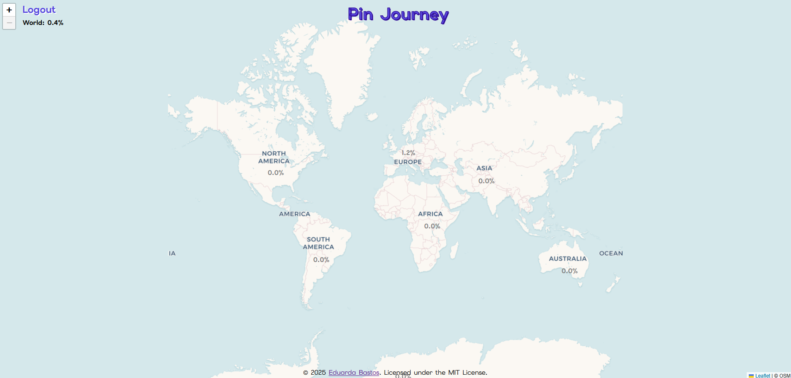

  
# Pin Journey

<i>An interactive map to track and visualize the places you've been.</i>

<kbd>  </kbd>

 

 

## Table of Contents

- [Features](#features)
- [How to Use](#how-to-use)
- [Contributing](#contributing)
- [License](#license)

 

## Features

- **Interactive World Map**: Explore the world with smooth zooming and panning, from continents to countries and individual states or provinces.
- **Dynamic State Coloring**: Click to mark visited states, provinces, or regions. Colors automatically match the continent for a cohesive look.
- **Smart Syncing Across Devices**: Your visited locations are securely synced between devices using Firebase authentication and Firestore.
- **Offline Mode with Auto-Sync**: Add or modify your visited places while offline. Once you log in again, the app automatically detects changes and syncs your latest data to the cloud.
- **Auto Login Memory**: You don’t need to sign in every time, Firebase remembers your session for a seamless experience.
- **Progress Statistics**: Real-time percentage indicators show your global, continental, and country-level travel progress.
- **Map Adaptation by Zoom**: The map dynamically switches between continent, country, and state-level views, adjusting labels and details automatically.
- **Lightweight and Fast**: Uses vector-based GeoJSON rendering and on-demand data loading for excellent performance, even on mobile.
- **Mobile-Friendly Layout**: Fully responsive interface that adapts to any screen size, perfect for tracking your travels on the go.

 

## How to Use

1. **Explore and Zoom**: Use pinch or scroll to zoom in and out between continents, countries, and states.
2. **Mark Visited States**: Tap or click a region to mark it as visited. A colored fill and pin will appear.
3. **Sign In with Google**: Click **Login with Google** to securely sign in and sync your progress to your account.
4. **Sync and Continue Anywhere**: When you sign in on another device, all your visited locations appear instantly.
5. **Offline Usage**: You can continue marking places while logged out, your updates will sync next time you log in.
6. **Logout Anytime**: Click **Logout** to switch accounts or stop syncing temporarily.

 

## Contributing

- Support this project by giving it a star ⭐. Thanks!
- Feel free to suggest improvements or report any issues in the repository.

## License

This project is licensed under the MIT License - see the [LICENSE](LICENSE) file for details.
